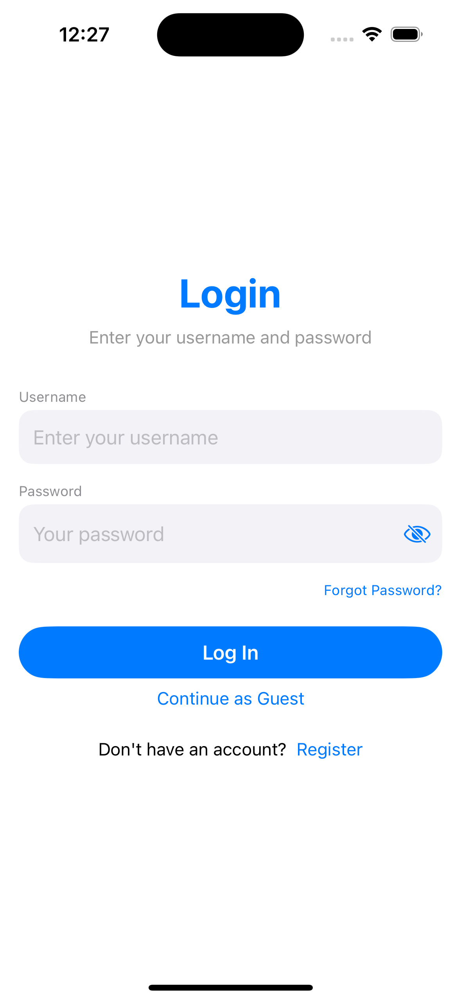
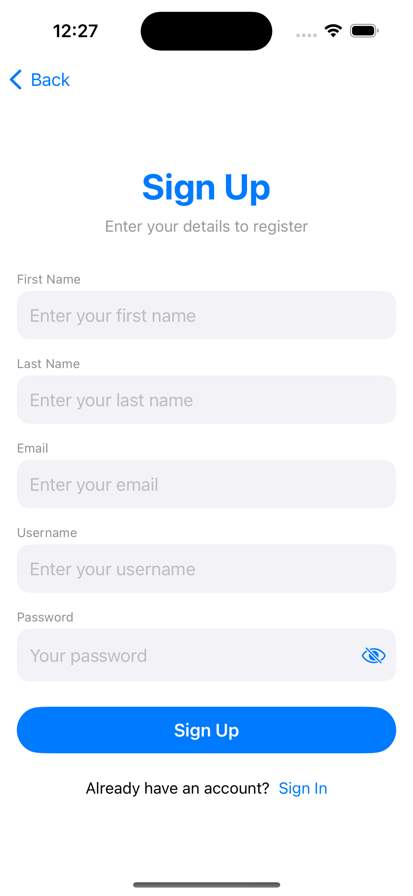
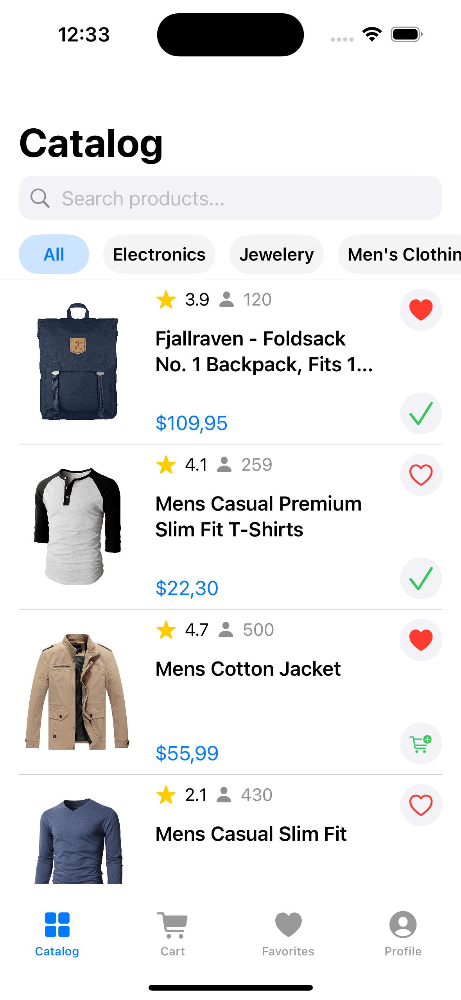
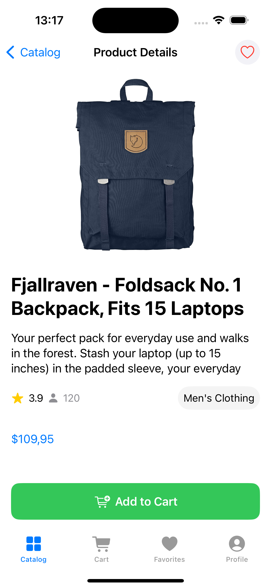
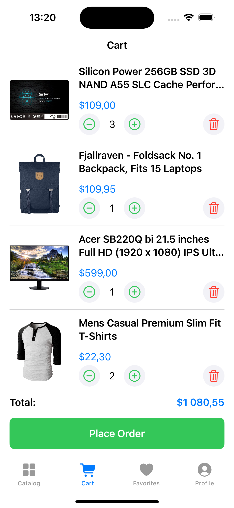
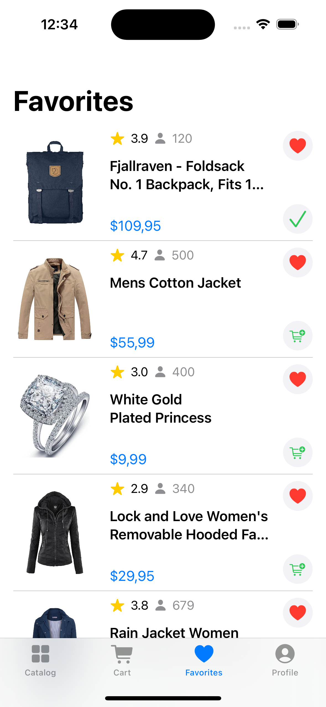
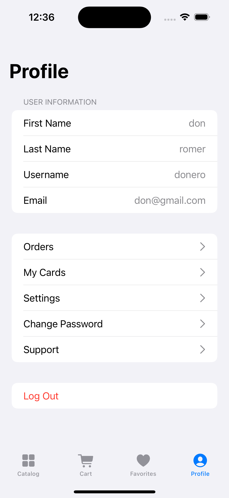

# StyleShop

StyleShop is an iOS e-commerce application built entirely with SwiftUI. It allows users to browse products, search and filter by category, add items to a shopping cart or favorites, and manage their account via login, registration, or guest access.

The app fetches data from the public [Fake Store API](https://fakestoreapi.com/), including products, categories, and user information. It follows the MVVM architectural pattern to ensure clear separation of concerns and maintainability. Networking is handled using URLSession with Structured Concurrency (async/await), and remote image loading is powered by Kingfisher for efficient caching and performance.

## Stack  

- **iOS Version:** 15.0+  
- **Technologies:** Swift, SwiftUI  
- **Persistence:** UserDefaults (stores auth token, user info, session mode)
- **UI:** Declarative SwiftUI views and reusable components 
- **Architecture:** MVVM with a modular, scalable structure
- **Image Loading:** Kingfisher (installed via Swift Package Manager)
- **Networking:** URLSession with structured URLComponents and error handling 
- **Concurrency:** Structured Concurrency (async/await)
- **State Management:** @StateObject, @ObservedObject, @EnvironmentObject, @Binding

## Features  

- Fetches and displays product data from the [Fake Store API](https://fakestoreapi.com/), including name, price, description, rating, category, and images
- Pull-to-refresh support for the product list using the refreshable modifier
- Scrollable horizontal category filter with capsule-style buttons that animate selection and dynamically update the product list
- Integrated search bar with real-time product filtering based on the search query
- Implemented swipe actions in the favorites list: swipe left to remove an item using .swipeActions
- Shopping cart functionality includes adding/removing products, modifying quantities, and calculating total price dynamically
- Instant navigation to the Cart tab from the Product Detail screen when tapping Add to Cart again
- The Place Order button becomes active only when the cart is not empty, visually indicating order availability
- Displays an alert upon successful order placement
- User authentication via API /auth/login, with login and registration support
- Password field includes a visibility toggle to show or hide the password
- Registration form validation, checking for required fields, valid email format, and minimum password length before API calls
- Persists user token and profile data (name, email, username) using UserDefaults
- Profile screen displays user details when logged in, or a guest placeholder with a call-to-action when not
- Uses Kingfisher for remote product image loading, with caching, placeholder loader, and graceful fallback on error
- Built with reusable, modular SwiftUI components to promote consistency and reduce code duplication across the UI.
- Networking and service layers are built using protocol-oriented Dependency Injection, improving testability and making the architecture scalable and modular.
- Uses Structured Concurrency (async/await) throughout the networking and service layers, enabling readable, maintainable code without nested completion handlers. This results in a clean, linear flow for asynchronous operations and improved error handling via do-catch.
- Tab-based navigation using TabView with four main sections: Catalog, Cart, Favorites, Profile
- Centralized constants used across the app for text, layout, images, API paths, keys, formats, and error messages
- The project is designed with scalability in mind: it follows the MVVM pattern, uses protocol-based abstractions for services, and separates concerns across modules, making it easy to extend

## Screenshots  

<table align="center">
  <tr>
    <td></td>
    <td></td>
  </tr>
  <tr>
    <td></td>
    <td></td>
  </tr>
  <tr>
    <td></td>
    <td></td>
  </tr>
    <tr>
    <td></td>
    <td></td>
  </tr>
</table>  

## Installation

1. Clone the repository:
```bash
git clone https://github.com/evgenff1/StyleShop.git
```
2. Open the project in Xcode (Version 15.2 or newer)
3. Build and run on a simulator or device running iOS 15 or later.

For authentication testing, use:
**Username:** donero
**Password:** ewedon
